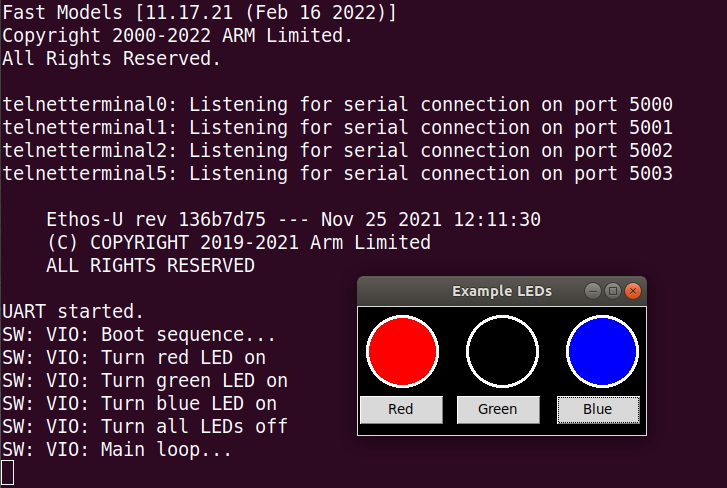

# LEDs Example

## Description

This example comes with software and Python interface to simulate the behavior of color LEDs.

## Requirements

This example requires Python tkInter to be installed. On Ubuntu, this can be installed with:

```
sudo apt install python3-tk
```

## Build

To build for Corstone-300, run:

```
make
```

For other targets, specify PLATFORM\_NAME. E.g.:

```
PLATFORM_NAME=VHT_MPS2_Cortex-M0 make
```

## Run

To run for Corstone-300, run:

```
run.sh
```

For other targets, specify PLATFORM\_NAME. E.g.:

```
PLATFORM_NAME=VHT_MPS2_Cortex-M0 make
```

## Output

When starting the application, a sequence of instructions will turn on all the LEDs and display status messages.
When this is completed, the user can click on the corresponding button to turn the LEDs on or off.


